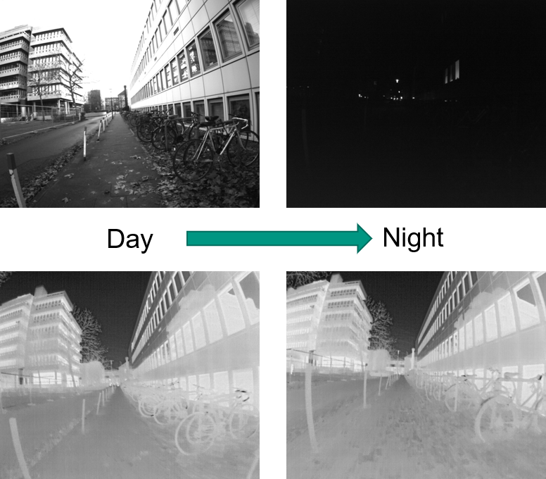
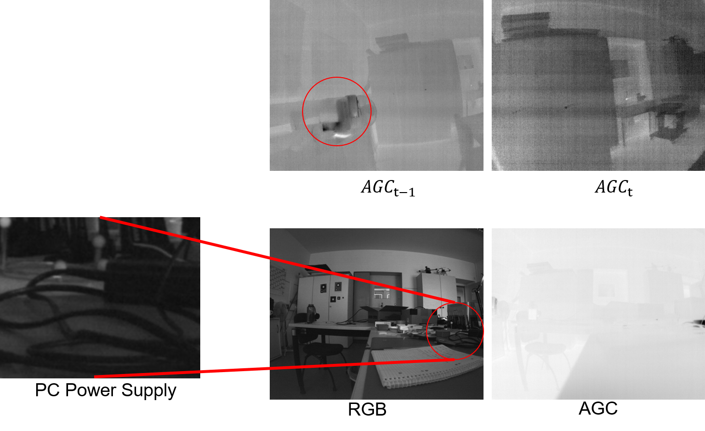
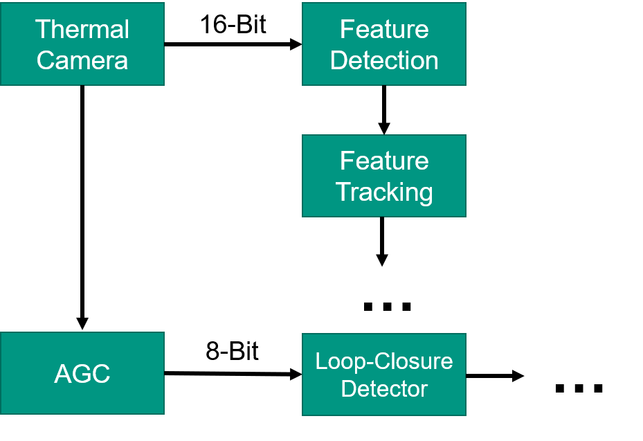
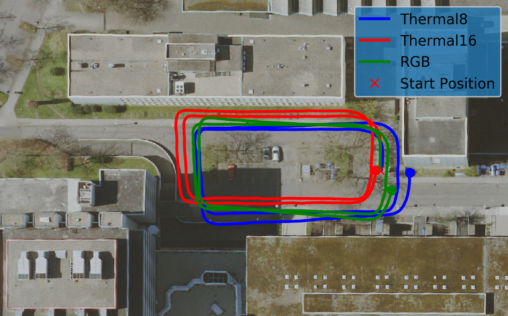
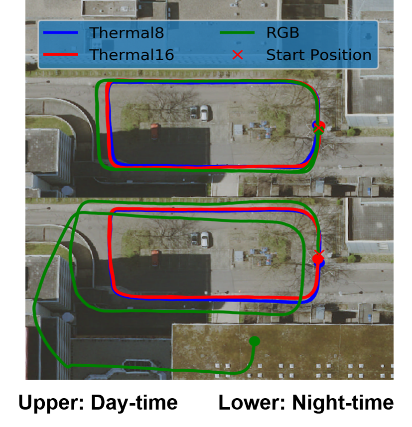

```
---
title: "Motion Estimation based on Thermal Inertial Odometry "
excerpt: "This thesis proposes a thermal-inertial odometry (TIO) framework based on the visual-inertial odometry framework considering the compatibility between those two. The TIO is tailored to utilize the full-size (16-Bit) thermal image data in feature detection and feature tracking. In parallel, a rescaled image (8-Bit) is used for loop-closure detection. The proposed TIO framework was validated with extensive datasets, including daytime and night-time scenes.<br/>"
collection: portfolio
---
```

## Abstract

Autonomous odometry of aerial robots in environments that are visually degraded, such as dark evening or smoke-filled, is always hard and challenging. However, a thermal camera could be one potential solution since it performs in the long-wave infrared spectrum and is thus not affected by the scene illumination changes or certain obscurants. Inspired by this fact, this thesis proposes a thermal-inertial odometry (TIO) framework based on the visual-inertial odometry (VIO) framework considering the compatibility between those two. The TIO is tailored to utilize the full-size (16-Bit) thermal image data in feature detection and feature tracking. In parallel, a rescaled image (8-Bit) is used for loop-closure detection. The proposed TIO framework was validated with extensive datasets, including daytime and night-time scenes.

## Motivation:

### Why Thermal Camera:

Unlike the normal camera, thermal cameras are not affected by the demanding conditions like poor illumination and presence of environmental obstacle since they are sensing the Long Wave Infrared (LWIR) part of the electromagnetic spectrum. 



### Why 16-Bit Pipeline:

To maintain a fine sensitivity while allowing for sensing a wind range temperature mapping, thermal cameras need to report data in a higher resolution of 16-Bit. To maintain compatibility of VIO and TIO, the previous researches generally scale the 16-Bit range into 8-Bit range.  However, this will cause

- Loss of information

- Attenuation of contrast when hot/ cold objects near the camera

- Significant changes in the appearance of successive images when hot/cold objects enter/leave the field of vision.



## Our Frontend Design:

The front-end has two pipelines. For image processing, including feature detection and feature tracking, we use the 16-bit full-size image. At the same time, we use AGC to rescale the image to 8-bit for loop-closure detection. However, OpenCV does not support the 16-bit image operator fully, so we have to implement some algorithms ourselves.



## Result:

### Without Loop-Closure:



### With Loop-Closure:



